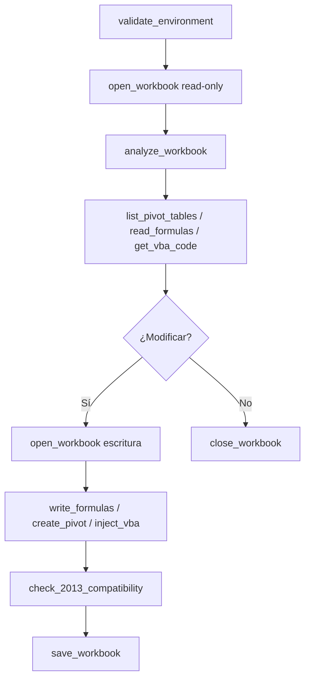

# excel-mcp-server-2013

> **📖 Manual Interactivo → [`MANUAL.md`](./MANUAL.md)**
>
> Guía completa de uso, casos de estudio reales y flujos de trabajo recomendados.

---

**Servidor MCP en Python** para automatización programática de **Microsoft Excel vía COM en vivo** (win32com). Diseñado para desenmarañar, armar y mejorar libros de Excel complejos ("herramientas") con múltiples hojas, decenas de miles de fórmulas, macros VBA, tablas dinámicas, Power Query y Power Pivot.

| Aspecto | Detalle |
|---|---|
| 🧩 **Stack** | Python 3.11+ · FastMCP 3.x · pywin32 · psutil · typer |
| 💻 **Desarrollo** | Office LTSC Professional Plus 2021 (v16.0, 64-bit) |
| 🎯 **Target** | Excel 2013 Professional Plus (Power Query v2.62 legacy) |
| 🔧 **Tools** | **57 herramientas MCP** organizadas en 13 módulos |
| 🏗️ **Arquitectura** | Thread STA dedicado · DispatchEx (instancia propia) · Recovery automático |

> ¿Por qué COM y no openpyxl? Porque solo el Excel vivo puede ejecutar macros VBA, refrescar Power Query, calcular fórmulas y crear tablas dinámicas **nativas**, idénticas a las que haría un humano con la interfaz de Excel.

---

## Arquitectura del sistema

```
[Cliente MCP / agente IA]
        ↕ MCP (stdio JSON-RPC)
[FastMCP server]  ← lifespan: cierra Excel al apagar, sin zombies
        ↕
[ExcelWriteGuard] ← thread STA dedicado (COM thread-affinity)
        ↕
[SessionManager]  ← DispatchEx (instancia propia), PID por Hwnd, lazy init
        ↕
[EXCEL.EXE en vivo] → VBA · Power Query · Tablas dinámicas · Fórmulas
```

### Principios de diseño

- **Instancia aislada**: usa `DispatchEx` para crear una sesión de Excel propia — nunca interfiere con Excel que el usuario tenga abierto.
- **Inicialización perezosa (lazy)**: Excel solo se inicia cuando la primera tool lo requiere (el `ping` responde sin abrir Excel).
- **Thread-safe COM**: toda operación COM se ejecuta en un thread STA dedicado, respetando la afinidad de apartment de COM.
- **Recuperación automática**: si EXCEL.EXE muere, el servidor lo detecta vía psutil (PID + create_time) y reinicia la sesión en la siguiente llamada.

---

## Instalación

```powershell
cd excel-mcp-server-2013
uv sync            # crea/actualiza .venv e instala el proyecto
uv run excel-mcp-2013 --help
```

## Configuración del servidor MCP

Ejecuta el servidor en modo stdio (transporte por defecto para clientes MCP):

```powershell
uv run excel-mcp-2013 stdio
```

Para modo HTTP (Streamable HTTP):

```powershell
uv run excel-mcp-2013 http --port 8080
```

### Verificación rápida

```powershell
# 1. Inicia el servidor (ping responde sin abrir Excel)
uv run excel-mcp-2013 stdio

# 2. Conecta desde tu cliente MCP, llama a get_session_info
#    (arranca Excel invisible y devuelve PID + versión)

# 3. Al detener el servidor, verifica que no queden zombies:
tasklist | findstr EXCEL
```

---

## Documentación

| Documento | Contenido |
|---|---|
| [📖 Manual Interactivo](MANUAL.md) | **Punto de partida**: casos de uso, flujos de trabajo, limitaciones conocidas |
| [📚 Referencia de Tools](TOOLS.md) | API completa de las 55 herramientas (argumentos, retornos, notas) |
| [🤖 Contexto para Agentes](excel-mcp-server-2013/CLAUDE.md) | Arquitectura, restricciones y convenciones para desarrolladores (archivo local) |

---

## Seguridad

| Aspecto | Comportamiento |
|---|---|
| **Instancia propia** | `DispatchEx` crea una sesión de Excel separada — nunca toca Excel del usuario |
| **Macros deshabilitadas** | Al abrir archivos, las macros NO se cargan por defecto (`AutomationSecurity=ForceDisable`) |
| **Guardado explícito** | `close_workbook` por defecto descarta cambios; guardar es siempre una acción explícita |
| **Sin zombies** | Limpieza de 3 niveles al apagar: `Quit()` cooperativo → `gc.collect()` → kill del PID exacto |
| **Protección contra crashes** | Recovery automático pre-flight (reinicia si el proceso murió entre llamadas); mid-flight lanza error sin reintentar |
| **Traducción de errores COM** | HRESULTs traducidos a mensajes accionables en español (proceso muerto, ocupado, 1004, elemento inexistente) |

---

## Herramientas disponibles (48)

| Módulo | Tools | Funcionalidad |
|---|---|---|
| **Sesión** | 3 | `ping`, `get_session_info`, `close_excel` |
| **Workbook** | 7 | `open_workbook`, `save_workbook`, `close_workbook`, `list_sheets`, `create_sheet`, `delete_sheet`, `analyze_workbook` |
| **Celdas y fórmulas** | 6 | `read_range`, `write_range`, `read_formulas`, `write_formulas`, `apply_format`, `auto_fit_columns` |
| **VBA** | 5 | `list_vba_modules`, `get_vba_code`, `execute_vba_macro`, `inject_vba_code`, `analyze_vba_project` |
| **Power Query** | 5 | `list_power_queries`, `get_power_query_m`, `refresh_power_query`, `validate_m_code`, `m_function_compatible` |
| **Power Pivot / DAX** | 5 | `list_data_model_tables`, `evaluate_dax_query`, `get_data_model_measures`, `add_table_to_data_model`, `refresh_data_model` |
| **Tablas dinámicas** | 3 | `list_pivot_tables`, `create_pivot_table`, `refresh_pivot_tables` |
| **Comprensión semántica** | 6 | `profile_formulas`, `trace_cell`, `check_2013_compatibility`, `map_dependencies`, `analyze_vba_project`, `document_workbook` |
| **ELT** | 4 | `add_data_model_measure`, `add_power_query`, `write_cube_formulas`, `setup_refresh_macro` |
| **Introspección visual** | 3 | `list_shapes`, `list_charts`, `list_slicers` |
| **Diagnóstico** | 2 | `discover_capabilities`, `validate_environment` |

---

## Flujo de trabajo recomendado



Ver detalles y ejemplos completos en el [📖 Manual Interactivo](./MANUAL.md).

---

## Licencia y créditos

Basado en el fork conceptual de [haris-musa/excel-mcp-server](https://github.com/haris-musa/excel-mcp-server)
(estructura Python/FastMCP) con los patrones de robustez de
[sbroenne/mcp-server-excel](https://github.com/sbroenne/mcp-server-excel)
(SessionManager, STA guard, orphan guard de 3 niveles) portados de C# a Python.
